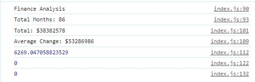

# Console-Finances
JavaScript Console Finances Report

## Description 
This webpage contains information on a log of finances. Required information is stored within the console. The aim was to find the total number of months and net total amount of loses/profits from the data set which has been achieved. Further requirements included finding average changes in profits/loses, greatest increase in profit and greatest decrease in loses which has not yet been achieved. Through this project, I have developed my understanding of arrays, javaScript basics and variables. Moving forward, I will repair the errors for the last two parts of the task. 

## Installation

To work on this code copy this SSH key: git@github.com:chelsea32568/Console-Finances.git and paste into your desired folder using Git Bash. Then use git pull to pull the file into your local repository. Make necessary changes and then add changes into the git repository by using git add -A, git commit -m "", git push. 

## Usage 
If you open the webpage, inspect and find the console log you will see the following information:

## Credits

* Tyler - Ask BCS Learning Assistant 
* [Javascript Arrays](https://www.w3schools.com/jsref/jsref_obj_typed_array.asp)

## License
MIT License

Copyright (c) [2023] [Chelsea Chapman]

Permission is hereby granted, free of charge, to any person obtaining a copy
of this software and associated documentation files (the "Software"), to deal
in the Software without restriction, including without limitation the rights
to use, copy, modify, merge, publish, distribute, sublicense, and/or sell
copies of the Software, and to permit persons to whom the Software is
furnished to do so, subject to the following conditions:

The above copyright notice and this permission notice shall be included in all
copies or substantial portions of the Software.

THE SOFTWARE IS PROVIDED "AS IS", WITHOUT WARRANTY OF ANY KIND, EXPRESS OR
IMPLIED, INCLUDING BUT NOT LIMITED TO THE WARRANTIES OF MERCHANTABILITY,
FITNESS FOR A PARTICULAR PURPOSE AND NONINFRINGEMENT. IN NO EVENT SHALL THE
AUTHORS OR COPYRIGHT HOLDERS BE LIABLE FOR ANY CLAIM, DAMAGES OR OTHER
LIABILITY, WHETHER IN AN ACTION OF CONTRACT, TORT OR OTHERWISE, ARISING FROM,
OUT OF OR IN CONNECTION WITH THE SOFTWARE OR THE USE OR OTHER DEALINGS IN THE
SOFTWARE.

© 2023 edX Boot Camps LLC. Confidential and Proprietary. All Rights Reserved.
